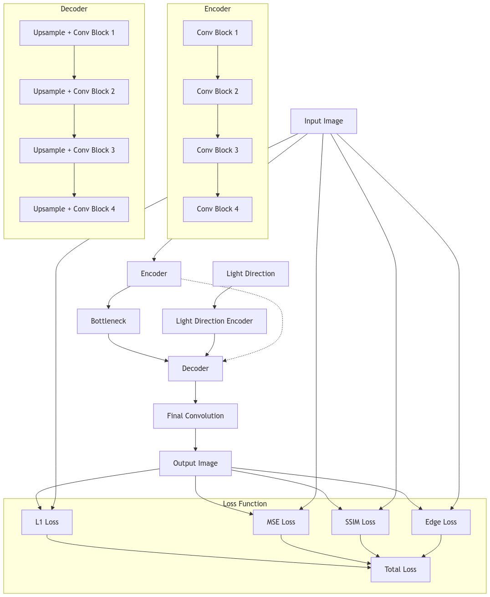

# IllumiNet: Deep Learning Image Relighting Model

## Overview

IllumiNet is an advanced deep learning model for image relighting. It takes an input image and a target light direction, producing a new image that represents how the scene would look under that specific lighting condition. This project leverages state-of-the-art deep learning techniques to achieve high-quality relighting results.

## Table of Contents

1. [Approach and Idea](#approach-and-idea)
2. [Architecture](#architecture)
3. [Loss Function](#loss-function)
4. [Training Process](#training-process)
5. [Code Structure](#code-structure)
6. [Dependencies](#dependencies)
7. [Installation](#installation)
8. [Usage](#usage)
9. [Results](#results)
10. [Future Work](#future-work)

## Approach and Idea

IllumiNet is based on a sophisticated deep learning approach to image-to-image translation, specifically tailored for the task of relighting images based on different light directions. The core idea is to learn a mapping function that can take an input image and a target light direction, and produce a new image that represents how the scene would look under that lighting condition.

Key components of our approach include:
1. U-Net architecture for preserving spatial information
2. Attention mechanisms for focusing on important features
3. Light direction encoding for conditioning the output
4. Custom loss function combining multiple image quality metrics

## Architecture

IllumiNet uses a modified U-Net architecture, which is well-suited for image-to-image translation tasks. Here's a breakdown of the main components:

1. Encoder:
   - Multiple layers of convolutional blocks that progressively downsample the input image
   - Each block consists of two convolutional layers followed by batch normalization and ReLU activation
   - Attention mechanisms are applied after each block to focus on important features

2. Bottleneck:
   - The deepest layer of the network, capturing the most abstract features

3. Decoder:
   - Mirror structure of the encoder, but with upsampling operations
   - Skip connections from encoder to decoder help preserve spatial information

4. Light Direction Encoder:
   - A separate network to encode the input light direction into a high-dimensional feature vector
   - This encoded light information is expanded and concatenated with image features

5. Final Convolution:
   - Produces the output image
   - Sigmoid activation ensures output values are in the range [0, 1]

## Loss Function

IllumiNet uses a custom loss function that combines multiple components:
1. L1 Loss: For pixel-wise accuracy
2. MSE Loss: For overall image similarity
3. SSIM Loss: For structural similarity
4. Edge Loss: To preserve edge information

## Training Process

- The model is trained on pairs of images and corresponding light directions
- AdamW optimizer is used with weight decay for regularization
- Learning rate scheduling (CosineAnnealingWarmRestarts) is employed for better convergence
- Early stopping is implemented to prevent overfitting

## Block diagram



## Code Structure

The project is organized as follows:

illuminet/
│
├── train.py              # Main training script
├── models/
│   └── illuminet.py      # IllumiNet model definition
├── utils/
│   ├── params.py         # Hyperparameters and configuration
│   └── data_loader.py    # Data loading and preprocessing
├── losses/
│   └── combined_loss.py  # Custom loss function
├── scripts/
│   └── visualize.py      # Visualization tools
├── requirements.txt      # Project dependencies
└── README.md             # This file

## Dependencies

IllumiNet relies on the following main libraries:

- Python 3.7+
- PyTorch 1.7+
- torchvision
- numpy
- matplotlib
- scikit-learn
- tqdm

For a complete list of dependencies, see `requirements.txt`.

## Usage

To train the IllumiNet model:

```python
from train import train

# Load your data
light_directions = ...  # Shape: (n, 3)
target_images = ...  # Shape: (n, h, w, 3)

train(light_directions, target_images)
```

## Results
After training, you can find the following in the output directory:

## Saved model checkpoints

Comparison images showing original vs. relit images
Loss evolution plot

## Future Work

Implement a more sophisticated light direction encoding
Explore different architectures for improved performance
Extend the model to handle multiple light sources
Develop a user-friendly interface for easy image relighting
Investigate the model's performance on diverse datasets

## Contributing
We welcome contributions to IllumiNet! Please feel free to submit issues, fork the repository and send pull requests!

## License
This project is licensed under the MIT License - see the LICENSE file for details.

## Acknowledgements

PyTorch for the deep learning framework

Cheminova project

All contributors and supporters of this project


